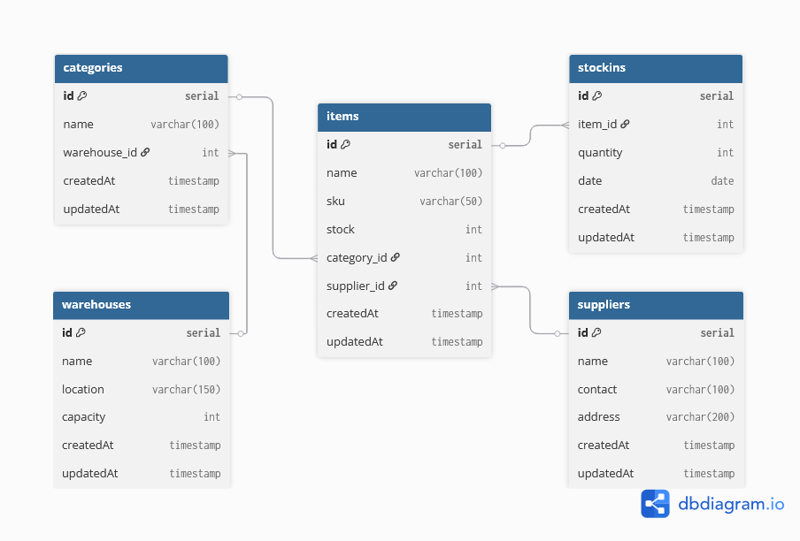

# Tables

## 🗄️ **Field Tables — INVENTORY MASTER**

Berikut **list field lengkap** untuk semua **5 tabel** sesuai relasi:

***

## 1️⃣ **Warehouse Table**

**Nama Tabel:** `Warehouses`

| Field     | Type    | Constraint         | Description        |
| --------- | ------- | ------------------ | ------------------ |
| id        | INTEGER | PK, Auto Increment | Primary Key        |
| name      | STRING  | NOT NULL           | Nama gudang        |
| location  | STRING  | NOT NULL           | Lokasi gudang      |
| capacity  | INTEGER | NULL               | Kapasitas maksimum |
| createdAt | DATE    | auto               | Timestamp          |
| updatedAt | DATE    | auto               | Timestamp          |

***

## 2️⃣ **Category Table**

**Nama Tabel:** `Categories`

| Field         | Type    | Constraint         | Description         |
| ------------- | ------- | ------------------ | ------------------- |
| id            | INTEGER | PK, Auto Increment | Primary Key         |
| name          | STRING  | NOT NULL           | Nama kategori       |
| warehouse\_id | INTEGER | FK → Warehouses.id | Relasi ke warehouse |
| createdAt     | DATE    | auto               | Timestamp           |
| updatedAt     | DATE    | auto               | Timestamp           |

***

## 3️⃣ **Supplier Table**

**Nama Tabel:** `Suppliers`

| Field     | Type    | Constraint         | Description    |
| --------- | ------- | ------------------ | -------------- |
| id        | INTEGER | PK, Auto Increment | Primary Key    |
| name      | STRING  | NOT NULL           | Nama supplier  |
| contact   | STRING  | NULL               | No. telp/email |
| address   | STRING  | NULL               | Alamat         |
| createdAt | DATE    | auto               | Timestamp      |
| updatedAt | DATE    | auto               | Timestamp      |

***

## 4️⃣ **Item Table**

**Nama Tabel:** `Items`

| Field        | Type    | Constraint         | Description     |
| ------------ | ------- | ------------------ | --------------- |
| id           | INTEGER | PK, Auto Increment | Primary Key     |
| name         | STRING  | NOT NULL           | Nama barang     |
| sku          | STRING  | UNIQUE, NOT NULL   | Kode barang     |
| stock        | INTEGER | DEFAULT 0          | Stok tersedia   |
| category\_id | INTEGER | FK → Categories.id | Relasi kategori |
| supplier\_id | INTEGER | FK → Suppliers.id  | Relasi supplier |
| createdAt    | DATE    | auto               | Timestamp       |
| updatedAt    | DATE    | auto               | Timestamp       |

***

## 5️⃣ **StockIn Table**

**Nama Tabel:** `StockIns`

| Field     | Type    | Constraint         | Description       |
| --------- | ------- | ------------------ | ----------------- |
| id        | INTEGER | PK, Auto Increment | Primary Key       |
| item\_id  | INTEGER | FK → Items.id      | Barang yang masuk |
| quantity  | INTEGER | NOT NULL           | Jumlah masuk      |
| date      | DATE    | NOT NULL           | Tanggal masuk     |
| createdAt | DATE    | auto               | Timestamp         |
| updatedAt | DATE    | auto               | Timestamp         |

***

## 🔗 **Relasi (1-to-Many)**

```
Warehouse (1) ──< Category (many)
Category (1) ──< Item (many)
Supplier (1) ──< Item (many)
Item (1) ──< StockIn (many)
```

Kalau mau, bisa sekalian aku buatkan **migration code Sequelize**, **model code**, atau **ERD visual**.\
Mau lanjut?

## DB DIAGRAM

```

Table warehouses {
  id            serial [pk]
  name          varchar(100)
  location      varchar(150)
  capacity      int
  createdAt     timestamp
  updatedAt     timestamp
}

Table categories {
  id            serial [pk]
  name          varchar(100)
  warehouseId  int [ref: > warehouses.id]
  createdAt     timestamp
  updatedAt     timestamp
}

Table suppliers {
  id            serial [pk]
  name          varchar(100)
  contact       varchar(100)
  address       varchar(200)
  createdAt     timestamp
  updatedAt     timestamp
}

Table items {
  id            serial [pk]
  name          varchar(100)
  sku           varchar(50) [unique]
  stock         int
  categoryId   int [ref: > categories.id]
  supplierId   int [ref: > suppliers.id]
  createdAt     timestamp
  updatedAt     timestamp
}

Table stockins {
  id            serial [pk]
  itemId       int [ref: > items.id]
  quantity      int
  date          date
  createdAt     timestamp
  updatedAt     timestamp
}

```

## ERD



## 📥 STOCKIN — FUNGSI & PENJELASAN

StockIn adalah fitur untuk mencatat setiap proses “barang masuk” ke dalam gudang. Setiap kali stok bertambah, sistem membuat satu record StockIn yang berisi:

* itemId → barang apa yang bertambah
* quantity → berapa jumlah yang masuk
* source → asal barang (supplier / retur / lainnya)
* date → kapan barang masuk

TUJUAN STOCKIN:

1. Menyimpan histori penambahan stok (audit log)
2. Mengontrol jumlah stok barang secara akurat
3. Membuat traceability: tahu sumber & waktu masuk barang
4. Relasi 1 Item → banyak StockIn

ALUR:

1. Frontend mengirim POST /stockin
2. Backend mencatat StockIn baru
3. (Opsional) Stok item bertambah otomatis

Contoh: Item “Mouse Logitech” masuk 30 unit → dibuat 1 record StockIn.
